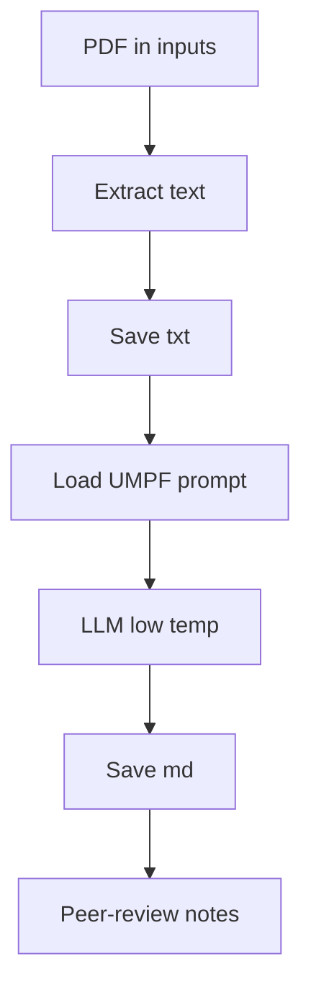

# Scientific Intuition Engine | Universal Monadic Pattern Framework (UMPF)

### Author: Michael Jagdeo
### Organization: Exponent Labs LLC
### Cite this:
Jagdeo, M. (2025). Scientific Intuition Engine (UMPF). Exponent Labs LLC. https://github.com/exponentlabshq/scientific-intuition-engine

Original Thesis: Jagdeo, M. (2025). The Rosetta Stone of UMPF: A Research Methodology. Exponent Labs LLC. https://github.com/exponentlabshq/the-rosetta-stone

How this solution was created: 
https://chatgpt.com/share/68aede11-3df4-8010-a06e-e7bda6ed259b

## 📋 **Table of Contents**
1. [Abstract](#abstract)
2. [Purpose](#purpose)
3. [The UMPF Frame](#the-umpf-frame)
4. [The Rosetta Stone: A Four-Layer Monadic Architecture](#-the-rosetta-stone-a-four-layer-monadic-architecture)
5. [Domain-Equivalent Pairs: How UMPF Chooses Cross-Domain Matches](#-domain-equivalent-pairs-how-umpf-chooses-cross-domain-matches)
6. [What the Current Artifacts Show](#what-the-current-artifacts-show)
7. [What main.py Does (run behavior)](#what-mainpy-does-run-behavior)
8. [Repository Contents](#repository-contents)
9. [Get Started](#get-started)
10. [License & Citation](#license--citation)

---

## Abstract

This engine converts canonical scientific sources into two auditable artifacts: (1) a citation‑grade verbatim text substrate and (2) a structured UMPF analysis that maps the source onto monads, graphs, lenses, and a four‑layer abstraction hierarchy. The goal is cross‑domain comparability, faithful provenance, and research acceleration without sacrificing rigor.

---

## Purpose

- Turn narrative into structure without losing truth.  
- Make discoveries comparable across disciplines via a shared language.  
- Create artifacts that are traceable (verbatim text), testable (formal schema), and portable (plain text/Markdown).

---

## The UMPF Frame

- **Monads (computation patterns)**  
  - Maybe: uncertainty/absence  
  - State: evolution/learning  
  - IO: boundary/interaction  
  - Free: orchestration/composition

- **Graphs (relational topology)**  
  Components and interactions; connectivity, modularity, dynamics over time

- **Lenses (focused transformation)**  
  Lawful get/set on subsystem state (Get‑Set, Set‑Get, Set‑Set)

- **Four‑Layer Hierarchy**  
  Atomic → Domain → Control → Orchestration

- **Domain Classification**  
  Physical, Informational, Human/Social, Creative (recurring monad/graph/lens signatures)

---

## 🔬 **The Rosetta Stone: A Four-Layer Monadic Architecture**

### **Layer 0 (Atomic)**: Primitive Operations
- **Monads**: Maybe, Either for handling absence and choice
- **Graphs**: Sparse connectivity, local interactions
- **Lenses**: Basic property access and modification

### **Layer 1 (Domain)**: Stateful Processes  
- **Monads**: State, Reader, Writer for context and evolution
- **Graphs**: Modular structure, functional connectivity
- **Lenses**: Contextual state transformations

### **Layer 2 (Control)**: Boundary Management
- **Monads**: IO, Async, STM for external interaction
- **Graphs**: Hierarchical control, feedback loops  
- **Lenses**: Interface management, protocol handling

### **Layer 3 (Orchestration)**: Emergent Behavior
- **Monads**: Free, Effect systems for compositional behavior
- **Graphs**: System-level organization, emergent properties
- **Lenses**: Strategic transformations, policy implementation

---

## 🏗️ **Domain-Equivalent Pairs: How UMPF Chooses Cross-Domain Matches**

### **Systematic Pattern Transfer Protocol**
UMPF uses a rigorous 6-step protocol to identify and validate cross-domain equivalences:
1. **Domain Decomposition**: Apply monad-graph-lens analysis to both source and target domains
2. **Pattern Matching**: Identify structural correspondences across the four abstraction layers
3. **Mechanism Mapping**: Translate mechanisms via categorical functors/natural transformations
4. **Hypothesis Generation**: Formulate testable predictions about transferred mechanisms
5. **Validation Protocol**: Design experiments to verify transfer effectiveness
6. **Iteration**: Refine mappings based on empirical results

### **Cross-Domain Similarity Metrics**
- **Structural Similarity**: Graph isomorphism and motif preservation across layers
- **Behavioral Similarity**: Monadic pattern correspondence (Maybe/State/IO/Free)
- **Functional Similarity**: Lens operation equivalence (lawful get/set flows)
- **Statistical Validation**: Correlation and effect-size thresholds (e.g., >10% improvement, p<0.05)

### **Why This Works**
- **Abstraction Alignment**: Comparable layers prevent false analogies
- **Monadic Pattern Match**: Ensures like-for-like computation patterns
- **Graph Structure Similarity**: Preserves constraints and feedback topology
- **Lens Compatibility**: Guarantees meaningful intervention/observation symmetry

---

## What the Current Artifacts Show

- A Nobel‑level primary source has been re‑expressed as:  
  - Verbatim text (title, authors, DOI, license preserved)  
  - A structured UMPF analysis with formal sections (e.g., Abstract; Formal Framework with Definitions 1–3; Monadic Domain Analysis; “7.2 Technology Development”).
- Outcome: a pair of artifacts that are traceable to the source, comparable across papers, and useful for cross‑domain reasoning.

---

## What main.py Does (run behavior)

- Auto‑selects the first `*.pdf` in `umpf_pipeline/inputs/` (sorted lexicographically).
- Extracts verbatim text with `pdfminer.six` and writes `outputs/<basename>.txt` (truth anchor).
- Loads the UMPF schema prompt from `umpf_pipeline/prompts/umpf_system_prompt.md` (or `.txt` fallback).
- Sends (txt, prompt) to OpenAI ChatCompletion (low temperature) and writes `outputs/<basename>.md` (structured analysis).
- Leaves peer‑review notes under `umpf_pipeline/peer-review/` for model/human audits.

Invariants: the `.txt` is source‑truth; the `.md` is a structured claim constrained by the schema. Analysis must be read against the verbatim anchor.

### Flow (GitHub-compatible)


---

## What hypothesis_engine.py Does (the Eureka Engine mode)

Where `main.py` takes **one** source and writes a full UMPF extension paper, `hypothesis_engine.py` takes **two domains** and writes a short, falsifiable hypothesis about a candidate functor between them — Koestler's bisociation (*The Act of Creation*, 1964), formalized through UMPF's monadic layers. This is the automated version of the manual process that produced every case study in `the-rosetta-stone/case-studies/`.

- **Explicit mode** — name two domains directly:
  ```bash
  python3 umpf_pipeline/hypothesis_engine.py \
    --domain-a "Ecology — mycorrhizal fungal networks" \
    --domain-b "Telecommunications — packet switching and routing"
  ```
- **Autonomous mode** — draw N fresh, unpaired domains from `umpf_pipeline/domains.json` and generate that many hypotheses in one run, with no human picking the pair:
  ```bash
  python3 umpf_pipeline/hypothesis_engine.py --autonomous --count 3
  ```

Each run writes to `umpf_pipeline/hypotheses/<date>-<domain-a>-x-<domain-b>.md` using the schema in `umpf_pipeline/prompts/umpf_hypothesis_prompt.md`: the two frames stated plainly, a four-layer monadic signature table, an explicit functor mapping (not a metaphor), one falsifiable prediction, and a mandatory, unsoftened self-critique (novelty distance 1-5, testability, prior-art honesty, confidence). `domains.json`'s `already_paired` list is checked before every autonomous pick and appended to after every run, so the pool never re-derives a pairing that's already a written case study, and never repeats itself across sessions.

Both scripts share the same `.env`-loading convention (`find_dotenv()` walks up from the file's own location, so a single root `OPENAI_API_KEY` covers both) and the same OpenAI SDK version (`openai>=1.0.0`, modern client, not the deprecated `openai.ChatCompletion` v0.28 call style).

---

## Repository Contents

- **readme.md** — Project overview, purpose, and framing (this document)
- **umpf_pipeline/**  
  - inputs/ — primary sources (PDFs), used by `main.py`
  - outputs/ — verbatim `.txt` and structured `.md` analyses, written by `main.py`
  - hypotheses/ — falsifiable two-domain hypotheses, written by `hypothesis_engine.py`
  - domains.json — seed domain pool + already-explored pairs, read/updated by `hypothesis_engine.py`
  - prompts/ — `umpf_system_prompt.md` (single-source mode) and `umpf_hypothesis_prompt.md` (two-domain mode)
  - peer-review/ — model/human audits (e.g., grok.md, openai.md)  
  - main.py — single-source orchestration script (full UMPF extension paper)
  - hypothesis_engine.py — two-domain orchestration script (the Eureka Engine — falsifiable hypotheses)
  - the-rosetta-stone-thesis.md — reference thesis text
- **LICENSE** — MIT
- **CITATION.cff** — repository citation and original thesis reference

---

## Get Started

**Single-source mode (main.py):**
1) Place a primary source in `umpf_pipeline/inputs/`  
2) Ensure a UMPF schema prompt exists in `umpf_pipeline/prompts/`  
3) Run the pipeline (see `umpf_pipeline/main.py`)  
4) Review artifacts in `umpf_pipeline/outputs/` (verbatim `.txt` and structured `.md`)

**Two-domain mode (hypothesis_engine.py):**
1) `pip install -r umpf_pipeline/requirements.txt` in a virtualenv
2) Confirm `OPENAI_API_KEY` is set (in this repo's `.env`, or a parent directory's — see the loading convention above)
3) Run explicit (`--domain-a` / `--domain-b`) or autonomous (`--autonomous --count N`) mode
4) Review artifacts in `umpf_pipeline/hypotheses/`

Principle: the verbatim `.txt` is the anchor; the `.md` is the formal claim against that anchor.

---

## License & Citation

- License: MIT (© 2025 Michael Jagdeo, Exponent Labs LLC)  
- Repo: https://github.com/exponentlabshq/scientific-intuition-engine  
- Cite this repository:
  - Jagdeo, M. (2025). Scientific Intuition Engine (UMPF). Exponent Labs LLC. https://github.com/exponentlabshq/scientific-intuition-engine
- Cite the original thesis:
  - Jagdeo, M. (2025). The Rosetta Stone of UMPF: A Research Methodology. Exponent Labs LLC. https://github.com/exponentlabshq/the-rosetta-stone

---

## Why These Folders Matter (the meat of the function)

- **inputs/** — Source of truth (primary artifacts)
  - Holds canonical PDFs. Nothing begins without a verifiable source.
  - Guarantees provenance: title, authors, DOI, license remain inspectable.

- **prompts/** — Formal schema (structure, not style)
  - Defines the analytical shape (sections, definitions, mappings) the model must honor.
  - Constrains interpretation so outputs are comparable across domains.

- **outputs/** — Twin artifacts (truth anchor + formal claim)
  - `<name>.txt`: verbatim substrate (citation‑grade; what the paper actually says).
  - `<name>.md`: structured UMPF analysis (how the paper is formally re‑expressed).
  - Read the `.md` against the `.txt`. If they diverge, the `.txt` wins.

- **peer-review/** — Audit loop (accountability and improvement)
  - Stores model/human critiques (e.g., grok.md, openai.md) tied to a specific run.
  - Turns one‑off generations into traceable research assets with a history of review.

Interaction:
- inputs → (schema in prompts) → outputs (.txt, then .md) → peer‑review → better prompts/analyses next run.
