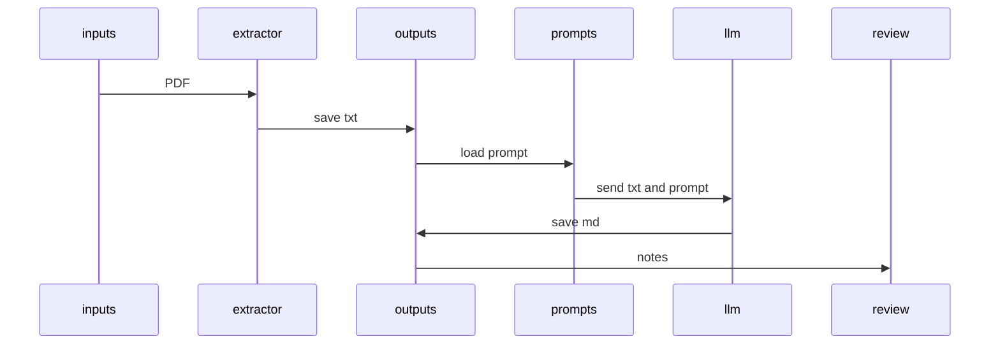

# UMPF Pipeline | Who • What • Where • Why • How

## Who
- Author: Michael Jagdeo  
- Organization: Exponent Labs LLC

## What
A minimal, fidelity‑first pipeline that:
- extracts verbatim text from a canonical PDF, and
- produces a structured UMPF analysis (Markdown) constrained by a formal prompt schema.

## Where
- inputs/ — place your PDF here  
- prompts/ — UMPF schema (e.g., `umpf_system_prompt.md`)  
- outputs/ — generated artifacts (`<name>.txt` verbatim, `<name>.md` structured)  
- peer-review/ — model/human audit notes tied to runs  
- main.py — the orchestrator (kept intentionally small)  
- the-rosetta-stone-thesis.md — reference thesis

## Why
- Preserve truth: verbatim `.txt` is a citation‑grade anchor.  
- Enforce structure: `.md` analysis follows a formal schema (monads, graphs, lenses, layers).  
- Enable comparability: identical structure across papers supports cross‑domain reasoning and meta‑analysis.  
- Make it portable: plain text/Markdown artifacts any model or collaborator can use.

## How (run this)
1) Put a PDF in `inputs/`  
2) Ensure a UMPF schema exists in `prompts/` (e.g., `umpf_system_prompt.md`)  
3) Install deps: `pip install -r requirements.txt`  
4) Run: `python3 main.py`  
5) Review `outputs/<name>.txt` (verbatim) and `outputs/<name>.md` (structured)

### Flow (simple sequence)

## Guarantees and Invariants
- `.txt` is the source of truth. If `.md` and `.txt` conflict, the `.txt` wins.  
- The prompt schema constrains analysis to comparable sections (e.g., Abstract; Formal Framework; Monadic mapping).  
- Peer‑review captures critique and iteration without losing provenance.

## Requirements
- Python 3.10+  
- `pip install -r requirements.txt` (pdfminer.six, openai 0.28 style, python‑dotenv, rich)  
- `.env` in repo root or parent (if enabling LLM analysis):  
  `OPENAI_API_KEY=...`

## Troubleshooting
- Empty `.txt`? PDF may be image‑only → add OCR fallback (e.g., Tesseract + pdf2image).  
- Long PDFs? Chunk before analysis → stitch outputs for `.md`.  
- Rendering on GitHub? Keep Mermaid node labels simple (no parentheses).

## License & Citation
- License: MIT (© 2025 Michael Jagdeo, Exponent Labs LLC)  
- Repo: https://github.com/exponentlabshq/scientific-intuition-engine  
- Cite this pipeline: Jagdeo, M. (2025). Scientific Intuition Engine (UMPF). Exponent Labs LLC.  
- Original Thesis: Jagdeo, M. (2025). The Rosetta Stone of UMPF. Exponent Labs LLC. https://github.com/exponentlabshq/the-rosetta-stone

