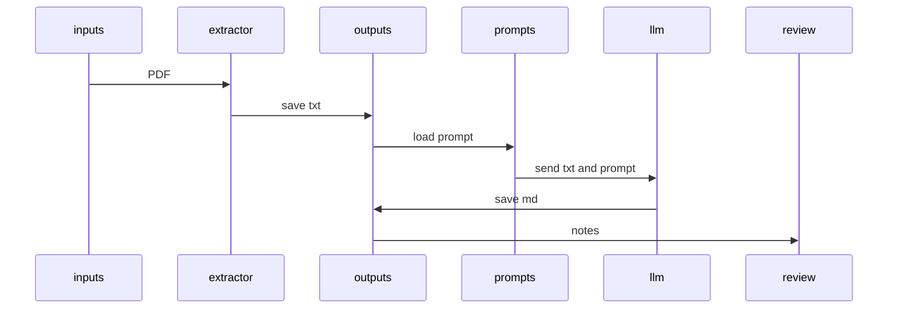

# UMPF Pipeline | Who • What • Where • Why • How

## Who
- Author: Michael Jagdeo  
- Organization: Exponent Labs LLC

## What
A minimal, fidelity‑first pipeline that:
- extracts verbatim text from a canonical PDF, and
- produces a structured UMPF analysis (Markdown) constrained by a formal prompt schema.

## Where
- inputs/ — place your PDF here  
- prompts/ — UMPF schema (e.g., `umpf_system_prompt.md`)  
- outputs/ — generated artifacts (`<name>.txt` verbatim, `<name>.md` structured)  
- peer-review/ — model/human audit notes tied to runs  
- main.py — the orchestrator (kept intentionally small)  
- the-rosetta-stone-thesis.md — reference thesis

## Why
- Preserve truth: verbatim `.txt` is a citation‑grade anchor.  
- Enforce structure: `.md` analysis follows a formal schema (monads, graphs, lenses, layers).  
- Enable comparability: identical structure across papers supports cross‑domain reasoning and meta‑analysis.  
- Make it portable: plain text/Markdown artifacts any model or collaborator can use.

## How (run this)
1) Put a PDF in `inputs/`  
2) Ensure a UMPF schema exists in `prompts/` (e.g., `umpf_system_prompt.md`)  
3) Install deps: `pip install -r requirements.txt`  
4) Run: `python3 main.py`  
5) Review `outputs/<name>.txt` (verbatim) and `outputs/<name>.md` (structured)

### Flow (simple sequence)

```mermaid
sequenceDiagram
    participant I as inputs
    participant E as extractor
    participant O as outputs
    participant P as prompts
    participant L as llm
    participant R as review

    I->>E: PDF
    E->>O: save txt
    O->>P: load prompt
    P->>L: send txt and prompt
    L->>O: save md
    O->>R: notes
```

## Guarantees and Invariants
- `.txt` is the source of truth. If `.md` and `.txt` conflict, the `.txt` wins.  
- The prompt schema constrains analysis to comparable sections (e.g., Abstract; Formal Framework; Monadic mapping).  
- Peer‑review captures critique and iteration without losing provenance.

## Requirements
- Python 3.10+  
- `pip install -r requirements.txt` (pdfminer.six, openai 0.28 style, python‑dotenv, rich)  
- `.env` in repo root or parent (if enabling LLM analysis):  
  `OPENAI_API_KEY=...`

## Troubleshooting
- Empty `.txt`? PDF may be image‑only → add OCR fallback (e.g., Tesseract + pdf2image).  
- Long PDFs? Chunk before analysis → stitch outputs for `.md`.  
- Rendering on GitHub? Keep Mermaid node labels simple (no parentheses).

## The Eureka Engine — hypothesis_engine.py + verification (Phase 1 + Phase 2)

`main.py` above takes one paper and writes one structured UMPF analysis. `hypothesis_engine.py`
is a separate, faster mode: given two domains (or one, for Janusian), it generates a candidate
cross-domain hypothesis via one of three distinct generative mechanisms, run with `--mode
{bisociation,janusian,homospatial}`. Explicit pair/domain or `--autonomous --count N` (draws
fresh unpaired domains from the combined pool — `domains.json` unioned with
`rosetta_stone_domains.json` and `equivalency_training_domains.json`, 170 domains total). Outputs
land in `hypotheses/`.

- **Bisociation** (Koestler) — two domains collide horizontally; each stays itself, a functor maps
  between them.
- **Janusian** (Rothenberg) — one domain's load-bearing assumption is held against its exact
  opposite, simultaneously, within a single instance — a genuine paradox, not a compromise. Prompt:
  `prompts/umpf_janusian_prompt.md`, with a mechanical "same-instance test" catching the compromise-
  wearing-paradox failure mode a soft prompt instruction alone did not.
- **Homospatial** (Rothenberg) — two domains are superimposed until they fuse into one new entity,
  not compared side by side. Prompt: `prompts/umpf_homospatial_prompt.md`, with a code-level scan
  for comparison language ("like," "similar to," "akin to") and one corrective re-prompt, for the
  same reason: a written-only rule got talked past by the model it was supposed to constrain.

**Phase 2 — verification (added 2026-08-28).** Every hypothesis's own self-critique includes "known
prior art: not verified" — a hand-wave, not a check. Phase 2 resolves it: web search against the
hypothesis's claim, classified into one of four outcomes per `prompts/umpf_verification_prompt.md`
— COLLISION (the connection is already established; strong signal the engine reasons soundly,
weak/no signal the hypothesis itself is worth pursuing), ADJACENT_ACTIVE (real fertile ground near
the domains, exact connection still open — the target state), FACT_CHECK_FAIL (the domain
description itself is wrong), or NO_SIGNAL (nothing surfaces either way — genuinely ambiguous, not
a pass, routed to adversarial refutation — see `refutations/README.md`). Results land in
`verifications/` (one file per hypothesis, doesn't touch the original) and `verification-log.jsonl`
(append-only, the ledger `score_hypotheses.py` reads to produce `leaderboard.md`).

**Update (2026-08-29) — the standalone script now exists.** Every prior verification pass was
Claude-orchestrated: a live Claude Code session ran the searches by hand and applied the rubric
itself. That recurred as a real constraint, not a theoretical one — a prior session's own live
WebSearch budget (200 calls) was exhausted mid-batch after only 5 of 15 planned verifications,
leaving the other 10 `PENDING_VERIFICATION` until a later, dedicated session cleared the backlog.
`verify_hypothesis.py` closes that gap: real Tavily web search (`TAVILY_API_KEY` in the vault-root
`.env`) + GPT-4o classification against the exact same
`prompts/umpf_verification_prompt.md` rubric, run with `python3 verify_hypothesis.py
--all-unverified` — no live session, no WebSearch budget, schedulable via cron if unattended
verification is ever wanted. It writes the same `verifications/<slug>-verification.md` and
`verification-log.jsonl` shapes a human-run session already produces, with verification filenames
derived directly from the hypothesis slug so `assemble_experience_data.py`'s substring matcher
finds them with zero manual overrides. Smoke-tested end-to-end 2026-08-29 (parsing, real Tavily
search, structured GPT-4o classification, and the file/ledger write paths all confirmed against
scratch output before ever touching the real ledger).

**What's still true:** this doesn't remove the human editorial layer — a batch run unattended is
worth spot-checking the way any of this repo's automation is, and NO_SIGNAL cases still route to
the 3-independent-agent adversarial refutation protocol (still Claude-orchestrated; refutation was
never in scope for this script). What it removes is the actual bottleneck: generation was never
slow, verification throughput was, and that throughput is no longer capped by one session's
WebSearch budget.

## License & Citation
- License: MIT (© 2025 Michael Jagdeo, Exponent Labs LLC)  
- Repo: https://github.com/exponentlabshq/scientific-intuition-engine  
- Cite this pipeline: Jagdeo, M. (2025). Scientific Intuition Engine (UMPF). Exponent Labs LLC.  
- Original Thesis: Jagdeo, M. (2025). The Rosetta Stone of UMPF. Exponent Labs LLC. https://github.com/exponentlabshq/the-rosetta-stone

